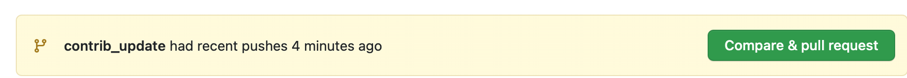
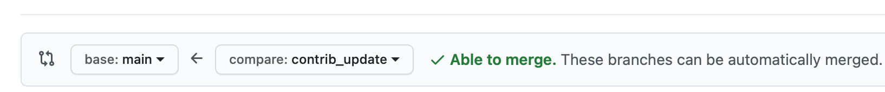
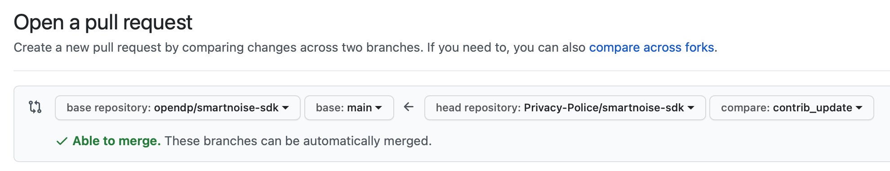

Contributing to SmartNoise
=============================
Contributions to SmartNoise are welcome. This document is here to simplify the onboarding experience for contributors, contributions to this document are also welcome.

System requirements
=============================
SmartNoise-sdk is python based. The initial setup will require a python
environment, ideally isolated with conda or venv. Below we have a conda based example for making changes to smartnoise-sql.

.. code-block:: bash

    conda create -n smartnoise python=3.8
    conda activate smartnoise
    git clone https://github.com/opendp/smartnoise-sdk.git
    cd smartnoise-sdk
    # switch to the project you want to work on
    # can be sql, synth, or evaluator
    cd sql
    python -m pip install -e .
    python -m pip install -r tests/requirements.txt

Verifying your SDK installation is running:

.. code-block:: bash

    pytest tests

The tests should all pass. If not, please check github issues for known build failures and report a new issue if not recorded.

Adding new tests
===============================
Add unit tests under the :code:`tests/` folder of the project you're working on.  Several test datasets will be downloaded automatically, and made available in the :code:`datasets/` folder of the repository root, as well as via database connections (when installed).  For more information, see the `datasets README
<sql/tests/README.md>`_
. Tests for the SDK should be quick. If not, please mark the test with @pytest.mark.slow.

There are existing datasets found in datasets/,
we tend to use the git relative path for access. As you can see below, the metadata tends to be in
a .yaml of the same name as the test dataset, schema.yaml files are needed for most supported DP algorithms.

.. code-block:: python

    import subprocess
    git_root_dir = subprocess.check_output("git rev-parse --show-toplevel".split(" ")).decode("utf-8").strip()
    meta_path = os.path.join(git_root_dir, os.path.join("datasets", "reddit.yaml"))
    csv_path = os.path.join(git_root_dir, os.path.join("datasets", "reddit.csv"))

Contributing a Patch or Feature
===============================

If you will be making regular contributions, or need to participate in code reviews of other people's contributions, your GitHub ID should be added to the "Contributors" group.  Regular contributors submit patches or features via a feature branch:

.. code-block:: bash

    git checkout main
    git pull
    git checkout -b branchname
    git push -u origin branchname

Branches should be scoped tightly to work that can be delivered and reviewed in a manageable amount of time.  Feature branches should align with only one pull request, and should be deleted after the PR is approved and merged.  Larger or more open-ended work items should be broken into more scoped pull requests, with one feature branch per pull request.  Naming should be moderately descriptive (e.g. :code:`bugfix_double_spend`) but can be short.

From your new feature branch, make all of your changes.  You can check in changes and use :code:`git push` to periodically synchronize local changes with the feature branch in GitHub.

If other patches or feature branches have been merged to main while you are working, your branch may be out of sync with main.  This is usually not a risk with small patches, but is more likely as development takes longer.

You will need to make sure your branch includes latest changes to main before submitting the pull request.  To do this, you commit any uncommited changes, switch to main and pull, then switch back to your branch and merge.

.. code-block:: bash

    git commit -m "saving changes before merge"
    git push # optional
    git checkout main
    git pull
    git checkout branchname # switch back to your branch
    git merge main

If there are no changes that conflict with your branch, the merge will automatically succeed, and you can check it in, push, and move on to the pull request.  If there are merge conflicts, you will need to review and resolve the conflicts first.  Visual Studio Code has nice support for reviewing merge conflicts.

When the patch or feature is ready to submit, run the unit tests again to make sure there are no regressions.  From the project folder:

.. code-block:: bash

    pytest tests

You only need to run the unit tests for the project you've changed (sql, synth, or evaluator).  You can also run many of the CI tests locally to make sure the pull request gates are passing.  For more information, see the `Continuous Integration README
<.github/workflows/README.md>`_

Fix any regressions before creating a pull request.  Make sure that GitHub has the latest copy of your local changes:

.. code-block:: bash

    git push

To create the pull request, use your Web browser to navigate to the "pull requests" tab on github.com.  

Assign the pull request to someone on the development team for code review.  Once the pull request is submitted, some automated integration tests will run to check for regressions.  These tests can take several minutes to complete, and results will be shown in the "Automation" tab.

If there are comments or questions during code review, they will be shown in-line on the PR review page.  Code changes updates to the PR can be added automatically by changing the code in your local branch and running :code:`git push` to move commits into the open pull request.  Pushing new commits into the pull request will trigger the integration tests to run again.

When the PR has been approved, you will be able to merge it into main.  After the code is merged to main, you can delete the feature branch.

Contributing from a fork:
=========================

If you are submitting a one-time patch or feature, you can submit a pull request from your own fork.  Create and test your patch as above.  When it's time to submit the pull request, navigate your Web browser to the GitHub page for your fork, and go to the "pull requests" tab.  You will have the option to create a new pull request, and GitHub should automatically select base: :code:`opendp/smartnoise-sdk/main` for the destination, and your fork and branch as the source. 

Managing Dependencies
=====================

We try to minimize the number of dependencies.  Dependencies are managed with poetry.  

You can `install poetry here <https://python-poetry.org/docs/#installation>`_.

To add a dependency, use:

.. code-block:: bash

    poetry add
    
and to check that dependencies are solvable, use:

.. code-block:: bash

    poetry check

Releasing Packages
==================

To release a new package to PyPi, in a new release branch:

- Update :code:`pyproject.toml` to increment the version number
- Edit :code:`HISTORY.md` to add release notes
- Run :code:`poetry check`
- Run :code:`make setup` to autogenerate a new :code:`setup.py`
- Submit the pull request.  Ensure that all CI tests pass.  If not, make fixes and push.  Make sure to run `make setup` after any changes, since this also builds the wheel for publication
- Once all CI tests are passing, merge to main
- From the project folder in `main`, run `poetry publish` to publish the package
- From the project folder in `main`, run `git tag project/version`.  Tags should include the project name, and the letter 'v' before the version.  For example, to release version 0.2.2 of the :code:`synth` package, use `git tag synth/v0.2.2`.  After creating the release tag, push it to the server:
  
.. code-block:: bash

    git tag synth/v0.2.2
    git push origin synth/v0.2.2
