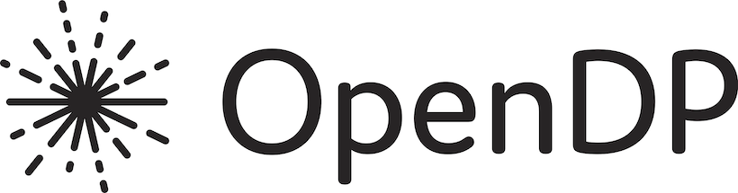

===============
SmartNoise Eval
===============

This library contains two primary components:

1. `Analyze`: Analyzes your source data to help you decide the best approach to producing synthetic data or private synopsis. Gives information on dimensionality, sparsity, and distribution of your data.

2. `Evaluate`: Evaluates the quality of your synthetic data or private synopsis. Compares the original data with the synthetic data or private synopsis to give you a sense of how well the synthetic data or private synopsis preserves the original data.

.. contents:: Table of Contents
  :local:
  :depth: 3

Getting Started
===============

API Reference
=============

Analyze
-------

.. autoclass:: sneval.Analyze
    :members:
    :undoc-members:
    :show-inheritance:

Dataset
-------

.. autoclass:: sneval.Dataset
    :members:
    :undoc-members:
    :show-inheritance:

Evaluate
--------

.. autoclass:: sneval.Evaluate
    :members:
    :undoc-members:
    :show-inheritance:

This is version |version| of the guides, last built on |today|.

